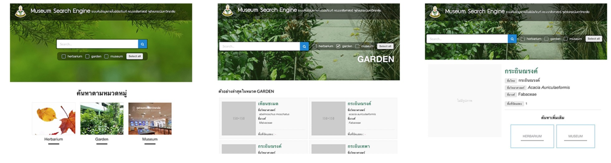

# CU Vivid Museum Wiki
[](http://commitizen.github.io/cz-cli/)

This project is created for normalize Plant data from Faculty of Pharmaceutical sciences, Chulalongkorn University to Web based application provide an easier way to search for information, available at [CU Vivid Museum website]().
# Feature
 - Normalize and seeding data from massy XLXS file to noSQL.
 - Searching Plant, Herb information over 8000+ items by scientific name.
 - Searching by Plant Category.
 - Content management system.
 - Public GraphQL api.

# TODO
 - Implement elastic search



# How we build it
We built this site with Monolithic NodeJS and popular modern web development tools like React (NextJS), GraphQL, Keystone and more.

## Stack Overall
**Server**
- Apollo GraphQL
- GraphQL compose
- ExpressJS
- KeystoneJS

**Client**
- React Universal (NextJS)

**Http service**
- NGINX

**Deployment**
- Circle-ci
- Docker


# System Requirements
1. [NodeJS](https://nodejs.org/en/)
    - Version 7.7.1 +
2. [Docker](https://www.docker.com/)
    - Version 17.03.0+
3. [MongoDB](https://www.mongodb.com/) ( In case you don't want to run Docker )
    - Version 3.4.2

# Start
This project use Docker as main process and server manager
```
 $ docker run -d 
 -e MONGO_URI=[mongouri (require)]
 -e COOKIE_SECRET=[cookie secret (require)]
 -e ROOT_EMAIL=[admin email (default root@vivid.com)]
 -e ROOT_PASS=[admin password (default root1234)]
 -e CLOUDINARY_URL=[cloudinary cloud url (require)]
 -e GRAPHQL=[graphql endpoint (default '/graphql')]
  rungsikorn/vivid
```


# Development
1. **Clone repository**
```
   $ git clone https://github.com/zapkub/cu-vivid-museum
   $ cd cu-vivid-museum
```
2. **Install dependencies**
```
    $ npm install
```

3. **Seed project DB** ( you can skip this )
    - This will create a json data for keystone update seed to DB and searching for images in `static/images/stock`.
```
    $ npm run json
```

> NOTE : 
**Garden and Museum** will refer first 2 words of Scientific name to image name by folder ( for instance `static/images/stock/garden/acanthopanax gracilistylus*/**` ), **Herbarium** will refer to image by `cuid` fields


4. **Start docker**
```
    $ docker-compose up -d
```
5. **Setup environment variable**
    - Copy `.env.example` and rename to `.env` then fill every field
> Note : Cloudinary url is cloud image storage service, you can sign up one for free [Cloudinary](https://cloudinary.com/console)
6. **Start project development**
```
    $ npm run watch
```

**Go to**
- Front-end: [http://localhost:3000](http://localhost:3000)
- Back-end: [http://localhost:3000/keystone](http://localhost:3000/keystone)
- GrapiQL : [http://localhost:3000/graphiql](http://localhost:3000/graphiql)

> NOTE : Step 5-6 is already created as bash script file you can just run `npm run dev`

# LICENSE
- In process of opensourcing

# CONTRIBUTOR
 1. Softever co.
 2. [Rungsikorn Rungsikavanich](https://github.com/zapkub)
